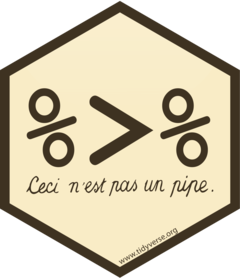

{align="right" width=100px}

## magrittr 

The __magrittr__ package provides the pipe operator, `%>%`, which improves code readability. 

__Link:__ https://magrittr.tidyverse.org/

### Example

We will use the following vector as example to compare base R syntax to the syntax used with __magrittr__.
```{r}
x.vec <- c("example 1", "example 1  ", "  example 1", "example_1") 

x.vec
```

The example below shows the base R syntax for chaining multiple function calls. Base R works from the inside out. Therefore, the functions in the code chunk below will be called in the following order:

1. `trimws()`
2. `stringr::str_replace_all()`
3. `unique()`

```{r}
unique(stringr::str_replace_all(trimws(x.vec), " ", "_"))
```

Using the pipe operator, `%>%`, we can create a more logical workflow, moving from left to right. The pipe opperator directs the output from the object to the left of the pipe operator to the first variable input of the function called to the right of the pipe operator. Therefore, the functions are called in the same order as the example above but in a format that is easier to interpret.
```{r}
library(magrittr)

x.vec %>% 
  trimws() %>% 
  stringr::str_replace_all(" ", "_") %>% 
  unique()
```