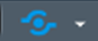

# Shiny
 
## What is Shiny?

Shiny is an R statistical software package that enables the developer to create interactive web applications (apps). 

__Example:__ https://zsmith.shinyapps.io/WQT_Shiny/
 
## Resources

R Studio has a website dedicated shiny (https://shiny.rstudio.com/). There are a lot of resources available here but for those just learning shiny or looking for a shiny refresher I would direct you to the tutorial page (https://shiny.rstudio.com/tutorial/). 
 
## Project Composition

Shiny apps are mainly composed of three files: 1) ui.R, 2) server.R, and 3) global.R.

### ui.R

In this file, you will specify the aesthetic aspects of the app. This includes: the presence/absence of a navigation bar, the presence and position of a dropdown menu, the presence and position of a sliderbar, and the location of figure created in the server.R file.

### server.R

In this file, you will specify reactive functions that respond to user inputs. For example, an app may contain a dropdown menu of sample sites and scatterplot representing the site selected in the dropdown menu. Each time the user selects a new sample site from the dropdown menu the scatterplot would update.

### global.R

In this file, you should include code that is static. This includes: loading libraries, sourcing functions, and potentially importing data. These activities are intended to occur once and will not be reacting to user inputs.

### Structure

Shiny projects generally grow rapidly and it can become difficult to navigate hundreds of lines of code in a ui.R or server.R file. My preference is to break the code up into independent and more manageable scripts that are sourced in the ui.R or server.R files. For example, imagine you are developing an app which contains two tabs, one dedicated to tabular data and one dedicated to an interactive map. I would develop separate R scripts for server code associated with each tab. Similarly, I would create separate R scripts for the ui code associated with each tab. These files are stored in the appropriate folders labeled either “ui” or “server.” When sourcing files in a shiny app you must specify “local = TRUE”.
```{r, eval=FALSE}
source("server/select_import_server.R", local = TRUE)
```

### R-Packages

Most Shiny apps will require multiple R-packages. I recommend loading all of the necessary R-packages in the global.R file. This makes it simple to identify all the packages you must have installed locally to edit and develop a given shiny app.
One way to simplify this task is to use the example provided by the following link: https://www.r-bloggers.com/install-and-load-missing-specifiedneeded-packages-on-the-fly/. Following this scripts template:

1.	You specify all of the necessary R-packages.
2.	The code checks that all these packages are installed.
3.	If any packages are not installed, the code will install these packages.

This makes it easier to collaborate with others or work on multiple computers. 
 
## Helpful R-Packages

### DT (Interactive Tables)

The R-package, DT, is great resource for creating interactive tables (https://rstudio.github.io/DT/).

### dygraphs (Interactive Time Series Plots)

The R-package, dygraphs, is great resource for creating interactive time series plots (https://rstudio.github.io/dygraphs/).

### leaflet (Interactive Maps)

The R-package, Leaflet, is a great resource for creating interactive maps (http://rstudio.github.io/leaflet/). When using this package in shiny there are a few steps you need to take to make the map function well (http://rstudio.github.io/leaflet/shiny.html). It is generally useful to create a leafletProxy, which will load the base map as shiny output. You can then use reactive functions to update the points presented on the map. Using leafletProxy, only the map points will update, the base map will remain unchanged. This prevents the need to reload the entire map each time the points are updated, which makes it appear that the map is flashing.

#### Mapbox

Mapbox is a platform that allows you to host interactive base map layers (https://www.mapbox.com). This is useful for shiny because these base layers can be referenced via the leaflet package function addTiles.
```{r, eval=FALSE}
leaflet::leaflet( )%>%
    leaflet::addTiles(urlTemplate = "https://api.mapbox.com/styles/v1/skaisericprb/citvqu6qb002p2jo1ig5hnvtk/tiles/256/{z}/{x}/{y}?access_token=pk.eyJ1Ijoic2thaXNlcmljcHJiIiwiYSI6ImNpa2U3cGN1dDAwMnl1cm0yMW94bWNxbDEifQ.pEG_X7fqCAowSN8Xr6rX8g")
```

### plotly (Interactive Figures)

The R-package, plotly, is great resource for creating interactive figures (https://plot.ly/r/). 

## Publishing

shinyapps.io is a shiny hosting platform provided by R Studio (http://www.shinyapps.io/). Users must create a shinyapps.io free account or a paid account. The free account limits the number of applications you can publish and the number of hours the app can be active per month. There are multiple tiers to the paid accounts. As the user pays more, the user can publish a greater amount of applications, more active hours are available per month, and other additional benefits are supplied by R Studio.

### How to Publish to shinyapps.io

1.	Click on the “Publish to Server” button located in the top right corner of the source pane. {width=60px}

2.	A drop-down menu will appear. Select the appropriate shinyapps.io app.
    + If this is your first time connecting to a shinyapps.io account.
        + Make sure you have created a shinyapps.io account (https://www.shinyapps.io/admin/#/login).
        + In the drop-down menu select “Manage Accounts.” This will bring you to the “Publishing Accounts” section of R Studios “Options.”
        + Select “Connect…”  -> “ShinyApps.io” option -> follow instructions.
3.	The “Publish to Server” window will appear. Select all of the files that are necessary for the app to run. Do not include unnecessary files, as this could slow down your app or make the app too large to host under your current account settings. Check the “Launch browser” check box. Click “Publish.”
4.	A “Deploy” tab will appear in the console pane, which will inform you that R Studio is working on publishing your app. This will take a few minutes. If there are any issues, the app will stop deploying and you will receive an error message. 


